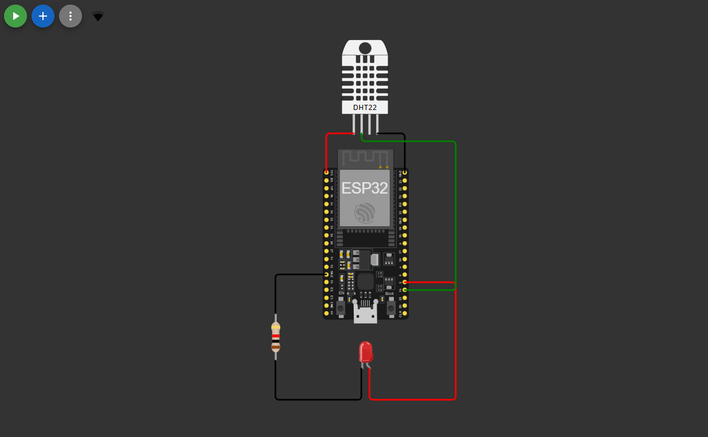

 

    
    <h3 align="center">Assignment SIC6 - Stage 1</h3>
     

        Rangkuman soal dan topologi
    

     

# Topologi Project

**Berikut beberapa perangkat yang saya gunakan :**

- **ESP32**
- **Transistor**
- **Lampu LED**
- **DHT22 (Sensor Suhu)**

# Goal
-    **Publish Sensor data ke MQTT Broker**
-    **Subscribe ke topic di WokWi ESP32 untuk meng-aktuasi LED ( On/Off )**

# Ketentuan
- **Menggunakan WokWi sebagai simulasi**
- **Menggunakan ESP32 sebbagai mikrokontroller**
- **Menggunakan bahasa pyhton**

# Link WokWi
 **https://wokwi.com/projects/420703564781776897**